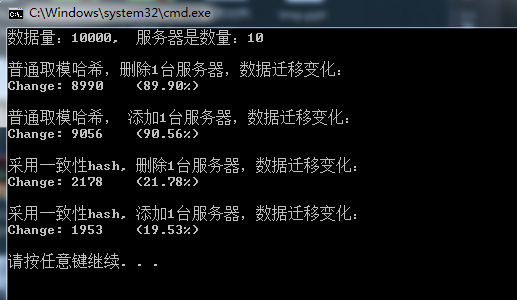

# 关于一致性hash的理解，需要多次阅读如下的博文体会

http://yikun.github.io/2016/06/09/%E4%B8%80%E8%87%B4%E6%80%A7%E5%93%88%E5%B8%8C%E7%AE%97%E6%B3%95%E7%9A%84%E7%90%86%E8%A7%A3%E4%B8%8E%E5%AE%9E%E8%B7%B5/

http://blog.csdn.net/cywosp/article/details/23397179

# 本项目代码说明

见codes_01文件夹

采用了crc32做hash,在实现hash ring的方式上就采用普通的数组和二分查找方法（也可以使用二搜索叉树系列，红黑树来做）。

* 测试环境

win7 + vs2013

* crc32算法代码

参考如下

https://github.com/pzx601917159/consistenthash/tree/master/c%2B%2B

* 一致性hash部分代码

参考如下
https://github.com/seth-hg/consistent_hash_demo

# 下面是结果对比分析

### 可以发现一致性hash会比普通的取模hash好很多？？？

在实现分布式上，可以采用一致性hash,当某个服务器挂机，或者新增了服务器的时候，数据的迁移量将不会很大.既满足如下的几点

* 尽可能使同一资源映射到同一台缓存服务器

* 增加一台时，新的服务器可以尽量分担其他所有服务器的缓存资源。减少一台机器时，其他所有的机器能均衡的负载　被删除缓存服务器上的资源。
